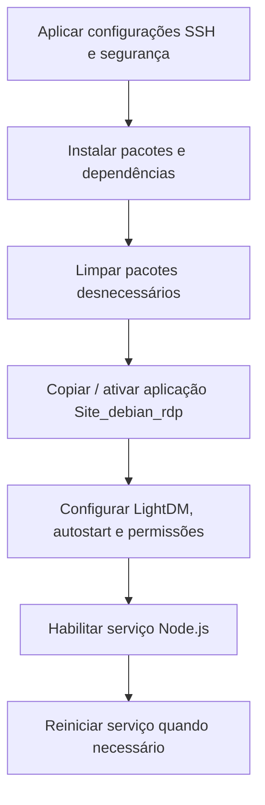

# Project_AOC (Ansible Open Configuration)

Este é um modelo de um projeto realizado em ambiente empresarial, a solução foca em ansible, para configuração automatizada de estações de usuarios. O principio do projeto original, é a implementação de automatização no ambiente de Suporte, nesse cenário inicial, foi utilizado para Desktops antigos (fora de linha) o uso de RDP para possibilitar a continuidade de tais Desktops

---

## 📁 Estrutura do Projeto

```
.
├── inventory.yaml                 # Inventário (hosts e users)
├── playbook.yaml                  # Playbook principal de configuração
├── playbook_First_connec.yaml     # Playbook para iniciar o RDP
├── group_vars/                    # Variáveis do Ansible
│   └── all/
│       └── passwd.yml             # Modelo de arquivo do Vault (exemplo)
├── Arquivos/                      # Arquivos locais usados pelo playbook
│   ├── firefox.desktop
│   ├── lxde-rc.xml
│   └── arquivo_backup/
│       └── lightdm.conf
└── Site_debian_rdp/               # Aplicação Node.js para RDP
    ├── server.js
    ├── conectar.sh
    ├── desligar.sh
    ├── package.json
    └── page/index.html
```


## Como Funciona (resumo)

Fluxo principal:


## Segurança e credenciais

- `group_vars/all/passwd.yml` é um **modelo** (arquivo de exemplo). Não coloquei credenciais reais em texto plano.
- Recomenda-se usar Ansible Vault para variáveis sensíveis:

```bash
ansible-vault encrypt group_vars/all/passwd.yml
```

- Sugestão de `.gitignore` para evitar commitar credenciais reais:

```
group_vars/all/passwd.yml
*.vault.yml
```

## Requisitos

- Hosts remotos: OpenSSH Server e Python 3.x
- Host RDP
- Host de controle: Ansible 2.9+ e acesso SSH aos hosts alvo

Instalar Ansible no host de controle (exemplo Debian/Ubuntu):

```bash
sudo apt-get update
sudo apt-get install ansible -y
```

## Como Usar

1. Atualize `inventory.yaml` com seus hosts e `ansible_user`.
2. Atualize e (se desejar) criptografe `group_vars/all/passwd.yml` com Ansible Vault.
   - '''bash
      ansible-vault encrypt group_vars/all/passwd.yml '''
3. Execute o playbook principal:

```bash
ansible-playbook -i inventory.yaml playbook.yaml --ask-vault-pass
```

4. Caso necessário, após reinicializações execute o playbook de conexão RDP:

```bash
ansible-playbook -i inventory.yaml playbook_First_connec.yaml --ask-vault-pass
```

## ℹ️ Para que Serve?

Automatiza a configuração de estações Linux Debian LXDE (instalação, ajustes de interface, serviços e integração RDP) para facilitar manutenção e padronização em larga escala.

## Referências

- [Documentação Ansible](https://docs.ansible.com/)
- [Documentação Express.js](https://expressjs.com/)
- [Documentação FreeRDP](https://github.com/FreeRDP/FreeRDP/wiki)

---

**Última atualização:** 9 de fevereiro de 2026  
**Versão:** 1.0.0
