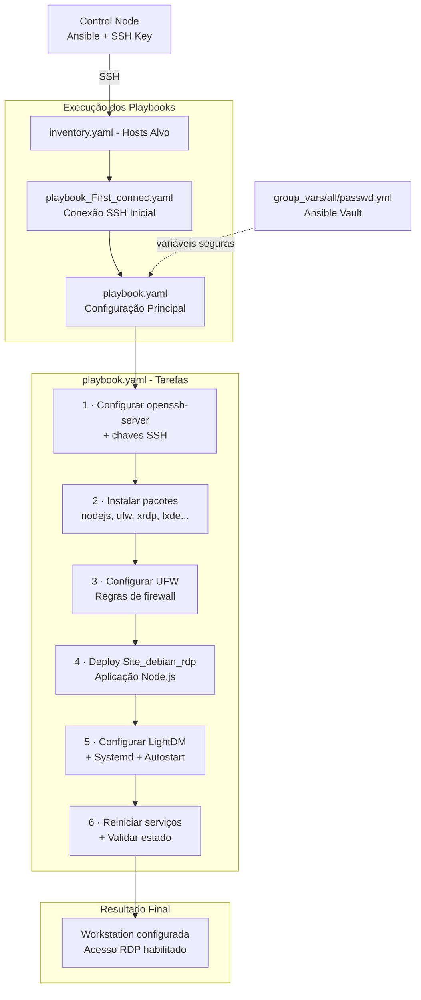

# Project_AOC — Ansible Open Configuration


> Automação de configuração em massa de workstations Linux Debian/LXDE via Ansible, habilitando acesso RDP remoto em máquinas descontinuadas para continuidade operacional em ambiente corporativo.

---

## Arquitetura


```mermaid
flowchart TD
    A[Control Node\nAnsible + SSH Key] -->|SSH| B[inventory.yaml - Hosts Alvo]

    subgraph Execução dos Playbooks
        B --> C[playbook_First_connec.yaml\nConexão SSH Inicial]
        C --> D[playbook.yaml\nConfiguração Principal]
    end

    subgraph playbook.yaml - Tarefas
        D --> E[1 · Configurar openssh-server\n+ chaves SSH]
        E --> F[2 · Instalar pacotes\nnodejs, ufw, xrdp, lxde...]
        F --> G[3 · Configurar UFW\nRegras de firewall]
        G --> H[4 · Deploy Site_debian_rdp\nAplicação Node.js]
        H --> I[5 · Configurar LightDM\n+ Systemd + Autostart]
        I --> J[6 · Reiniciar serviços\n+ Validar estado]
    end

    subgraph Resultado Final
        J --> K[Workstation configurada\nAcesso RDP habilitado]
    end

    L[group_vars/all/passwd.yml\nAnsible Vault] -.->|variáveis seguras| D
```

---

## Pré-requisitos

### Control node (máquina que roda o Ansible)

| Requisito | Versão mínima |
|---|---|
| Ansible | 2.9+ |
| Python | 3.8+ |
| Acesso SSH | Par de chaves configurado |

```bash
# Instalar Ansible no control node (Debian/Ubuntu)
sudo apt update && sudo apt install ansible -y

# Verificar instalação
ansible --version
```

### Hosts alvo (workstations a configurar)

- Debian 10+ ou Ubuntu 20.04+ com ambiente LXDE
- `openssh-server` instalado e acessível
- Python 3.x presente (necessário para módulos Ansible)
- Usuário com privilégios `sudo`

---

## Instalação e uso

### 1. Clone o repositório

```bash
git clone https://github.com/Theo-Panella/Project_AOC.git
cd Project_AOC
```

### 2. Configure o inventário

Edite `inventory.yaml` com os IPs e usuários dos hosts alvo:

```yaml
all:
  hosts:
    workstation-01:
      ansible_host: 192.168.1.100
      ansible_user: seu_usuario
    workstation-02:
      ansible_host: 192.168.1.101
      ansible_user: seu_usuario
```

### 3. Configure as variáveis sensíveis com Ansible Vault

```bash
# Editar o arquivo de variáveis (senhas, tokens)
cp group_vars/all/passwd.yml.example group_vars/all/passwd.yml

# Criptografar com Vault antes de commitar
ansible-vault encrypt group_vars/all/passwd.yml
```

> **Atenção:** nunca commite `passwd.yml` sem criptografia. O `.gitignore` já exclui arquivos `.vault.yml`, mas confirme antes de um `git push`.

### 4. Execute a configuração principal

```bash
ansible-playbook -i inventory.yaml playbook.yaml --ask-vault-pass
```
### 5. Execute o playbook de conexão inicial

Rode este playbook apenas na primeira vez, para configurar o acesso do xfreerdp:

```bash
ansible-playbook -i inventory.yaml playbook_First_connec.yaml --ask-vault-pass
```


O playbook executa em sequência: SSH → pacotes → UFW → Node.js → LightDM → serviços. Ao fim, o host está com RDP habilitado e pronto para acesso remoto.

### 6. (Opcional) Validar o estado dos hosts

```bash
# Testar conectividade com todos os hosts do inventário
ansible all -i inventory.yaml -m ping

# Verificar status dos serviços após configuração
ansible all -i inventory.yaml -m shell -a "systemctl status xrdp lightdm"
```

---

## Estrutura do projeto

```
Project_AOC/
├── inventory.yaml                  # Inventário de hosts
├── playbook.yaml                   # Playbook principal
├── playbook_First_connec.yaml      # Playbook de conexão inicial
├── group_vars/
│   └── all/
│       └── passwd.yml              # Variáveis sensíveis (Ansible Vault)
├── Arquivos/                       # Arquivos estáticos copiados para os hosts
│   ├── firefox.desktop
│   ├── lxde-rc.xml
│   └── arquivo_backup/
│       └── lightdm.conf
└── Site_debian_rdp/                # Aplicação Node.js para interface RDP
    ├── server.js
    ├── conectar.sh
    ├── desligar.sh
    ├── package.json
    └── page/index.html
```

---

## O que aprendi

Este projeto foi desenvolvido como réplica de uma solução real aplicada em ambiente corporativo. As principais lições técnicas e de processo:

**Ansible na prática vai além da documentação.**
Escrever playbooks que funcionam localmente é diferente de playbooks que são idempotentes, seguros e reutilizáveis em escala. Aprendi que `changed_when` e `failed_when` são tão importantes quanto as tasks em si — sem eles, o Ansible reporta estado incorreto e você perde a rastreabilidade da automação.

**Ansible Vault resolve um problema que a maioria ignora até errar.**
Em ambiente de laboratório é tentador deixar senhas em texto claro. Em produção, um `git push` sem vault é um incidente de segurança. Implementar o fluxo de vault desde o início do projeto criou o hábito correto antes de qualquer erro real.

**Systemd e LightDM têm dependências de ordem que o Ansible não resolve sozinho.**
Configurar display managers exige entender a cadeia de inicialização do Linux. Serviços que dependem de sessão gráfica falham silenciosamente se iniciados fora de ordem. Aprendi a usar `after=` e `requires=` em units do Systemd para garantir a ordem correta de forma declarativa.

**Infraestrutura como código muda a forma de pensar suporte.**
Antes desse projeto, configurar 10 máquinas significava 10 sessões SSH manuais. Com Ansible, o esforço de configurar 10 ou 100 máquinas é o mesmo. Isso não é só eficiência — é a diferença entre suporte reativo e infraestrutura gerenciável.

---

## Referências

- [Ansible Documentation](https://docs.ansible.com/)
- [Ansible Vault — managing secrets](https://docs.ansible.com/ansible/latest/vault_guide/index.html)
- [FreeRDP / xrdp Documentation](https://github.com/FreeRDP/FreeRDP/wiki)
- [Express.js Documentation](https://expressjs.com/)
- [Systemd Unit Files](https://www.freedesktop.org/software/systemd/man/systemd.unit.html)

---

*Desenvolvido por [Theo Panella](https://github.com/Theo-Panella) · Limeira, São Paulo*
