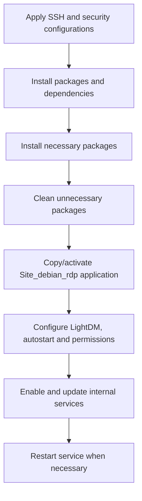

# Project_AOC (Ansible Open Configuration)

This is a template of a project carried out in a corporate environment. The solution focuses on Ansible for automated configuration of user workstations. The principle of the original project is the implementation of automation in the Support environment. In this initial scenario, RDP was used for old (discontinued) Desktops to enable the continuity of such Desktops.

- Configure secure connection via openssh-server
- Package Installation
- UFW Configuration
- Installation and Configuration for the Node site
- Systemd and Lightdm Configuration
- Graphical interface modification

---

## 📁 Project Structure

```
.
├── inventory.yaml                 # Inventory (hosts and users)
├── playbook.yaml                  # Main configuration playbook
├── playbook_First_connec.yaml     # Playbook to start RDP
├── group_vars/                    # Ansible variables
│   └── all/
│       └── passwd.yml             # Vault file template (example)
├── Arquivos/                      # Local files used by the playbook
│   ├── firefox.desktop
│   ├── lxde-rc.xml
│   └── arquivo_backup/
│       └── lightdm.conf
└── Site_debian_rdp/               # Node.js application for RDP
    ├── server.js
    ├── conectar.sh
    ├── desligar.sh
    ├── package.json
    └── page/index.html
```


## How it Works (summary)

Main flow:

```mermaid
flowchart TD
    A[Apply SSH and security configurations] --> B[Install packages and dependencies]
    B --> C[Install necessary packages]
    C --> D[Clean unnecessary packages]
    D --> E[Copy/activate Site_debian_rdp application]
    E --> F[Configure LightDM, autostart and permissions]
    F --> G[Enable and update internal services]
    G --> H[Restart service when necessary]
```

## Security and credentials

- `group_vars/all/passwd.yml` is a **template** (example file). Real credentials were not placed in plain text.
- It is recommended to use Ansible Vault for sensitive variables:

```bash
ansible-vault encrypt group_vars/all/passwd.yml
```

- `.gitignore` suggestion to avoid committing real credentials:

```
group_vars/all/passwd.yml
*.vault.yml
```

## Requirements

- Remote hosts: OpenSSH Server and Python 3.x
- RDP Host
- Control host: Ansible 2.9+ and SSH access to target hosts

Install Ansible on the control host (e.g., Debian/Ubuntu):

```bash
sudo apt-get update
sudo apt-get install ansible -y
```

## How to Use

1. Update `inventory.yaml` with your hosts and `ansible_user`.
2. Update and (if you want more security regarding this data) encrypt `group_vars/all/passwd.yml` with Ansible Vault.
``` bash
ansible-vault encrypt group_vars/all/passwd.yml
```
3. Run the main playbook:

```bash
ansible-playbook -i inventory.yaml playbook.yaml --ask-vault-pass
```

4. If necessary, after reboots, run the RDP connection playbook:

```bash
ansible-playbook -i inventory.yaml playbook_First_connec.yaml --ask-vault-pass
```

## ℹ️ What is it for?

Automates the configuration of Linux Debian LXDE workstations (installation, interface adjustments, services, and RDP integration) to facilitate large-scale maintenance and standardization.

## References

- [Ansible Documentation](https://docs.ansible.com/)
- [Express.js Documentation](https://expressjs.com/)
- [FreeRDP Documentation](https://github.com/FreeRDP/FreeRDP/wiki)

---

**Last updated:** February 9, 2026  
**Version:** 1.0.0
